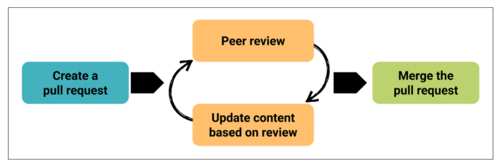
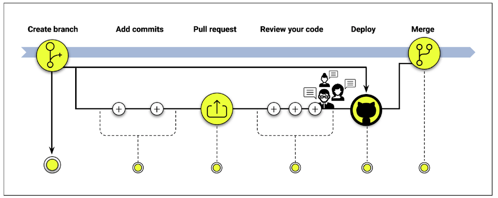
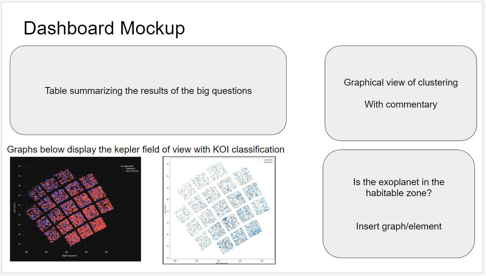

# KeplerExoplanets

## Presentation

### Selected topic
Exoplanet — searching for a new World beyond our solar system

### Reason why the topic has been selected
Is Earth the only habitable planet in the universe? Scientists and researchers are searching for planets that can provide similar living conditions for human, and those planets are called “exoplanet”. We want to investigate the exoplanet data provided by NASA Exoplanet Archive and find a habitable planet. 

### Description of the source of data
* https://exoplanetarchive.ipac.caltech.edu/index.html
* https://www.kaggle.com/nasa/kepler-exoplanet-search-results

### Questions we hope to answer with the data
* How many confirmed planets?
* What type of planets consider as confirmed planets? 
* Which confirmed planet is closest to Earth?
* What are the characteristics of confirmed planets? 
* Based on the characteristics, which confirmed planet is the most habitable? 
* What are the most recent discovered confirmed planets? 
* How often are exoplanets confirmed in the existing liteatures disconfirmed by measurement from Kepler?

Google slides drafting:
https://docs.google.com/presentation/d/1aQ9Man76uhiFXY43nu5pnqOB6zrk1MvBqSxHWUtZ_Y0/edit?usp=sharing

## GitHub
### Communication protocols
After each pull request (PR), the person in charge of the github repository will review the code and ask for team assistance if necessary.

After the PR has been accepted, the person who made the PR will merge her/his code to the main branch and alert the team that their own personal branch or sub-branch needs to be updated with the latest version of the main branch.

## Machine Learning Model
We have updated our target value to be the "Exoplanet_Archive_Disposition" which is a categorical field with three options: False Positive, Candidate & Confirmed.
- The prior target was binary-> Is it a planet or not: Disposition_Using_Kepler_Data. Models ran with this target achieved a 99% f1
- Applying additional domain knowledge reveals that the Exoplanet_Archive_Disposition is the results of a broader and more recent NASA analysis and therefore a better target selection

#### Based on the Dataset we will be evaluating the below (4) models.
|Model name|Benefits|Limits|
|---|--|--|
|Supervised ML logistic Regression|- Easy to understand predictions| - Could struggle with high dimensional datasets and correlated features|
|Gradient Boosted Tree|- High-performing  - Easy to understand predictions|- Sensitive to outliers|
|Random Forest|- High-performing - Robust against overfitting - Fast to train|- Not easy to understand predictions|
|Neural Net|- Handle extremely complex tasks|- Slow to train - Almost impossible to understand predictions|

Current f1 scores: 
Supervised ML logistic Regression: 83% 
Gradient Boosted Tree: 90% 
Random Forest: 90% 
Neural Net: 83.6% 
*Note that our Neural Net has been updated to a deep model using the "relu" and "softmax" activations

#### EDA & Preprocessing
Null Values
- A large number of Null values (40k+)are present in the raw data. After preprocessing (including dropping unneeded columns) 3,572 remain
- We are evaluating several methods for handling these: Dropping, Imputing (Mean, Median, Mode)
- Further analysis shows that roughly 363 rows contain nulls. After evaluating (running the ML models) each impute method and applying domain knowledge the best options is to drop these rows

Feature Evaluation & Selection
- We are primarily using a Sequential Feature Selector currently from the mlextend library. This performs an analysis on a range of possible features subset and scores them. Additionally we have a Correlation Matrix, Coefficient analysis and Feature Importance Graph to guide feature selection
- Each Model has been trained on a subset of features. The results reveal that dropping features actually slightly reduces our percentage. We are currently running the models on all features instead.

Creating test & train datasets
- Initially we set the targey(y) to koi_pdisposition and the features to the remaining columns based on the feature evaluation process
- The training & testing set are split in default manner which works out to 75% train & 25% test

Scaling
- The processed dataframe is scaled using ScikitLearns's standard scaler before the models are ran

## Database
We are using the Postgres DB, currently an instance running in AWS on a free tier.

The DB engine instance is called "kepler", with two tables
- "raw_kepler" & "kepler_habitable"
- raw_kepler is populated wth the CSV data file sourced from kaggle
- kepler_habitable is a populated with some data about the stellar object associated with the Kepler Object of Interest (KOI)

Project DB artifiacts of note:
- The DB & table definition SQL files are in the project Database folder.
- The source CSV files are in the project Resources folder.

We used the PG Admin console Import/Export tool to import the CSV files into the DB tables.

### DB Schema
- The column "kepoi_name" is the "raw_kepler" table's unique primary key, where each row represents one Kepler Object of Interest.
- The column "kepid" is the "habitable_data" table's primary key, where each row repesents the stellar object associated with a KOI.
- Join raw_kepler KOI data to it's associated stellar object data using "kepid" as a foreign key
- This is a one to many relationship, where any kepid star can have one or more related KOIs.

ERD - 

- Data dictionary "Data Columns in Kepler Objects of Interest Table" is located here "https://exoplanetarchive.ipac.caltech.edu/docs/API_kepcandidate_columns.html#tce_info"

## Dashboard
Google slides drafting: https://docs.google.com/presentation/d/1aQ9Man76uhiFXY43nu5pnqOB6zrk1MvBqSxHWUtZ_Y0/edit?usp=sharing

We are currently planning on using Tableau for the presentation & dashboard. The interactive elements will be the graphs shown.

Web application (work in progress) created to predict exoplanet prediction using various inputs and our trained/built models: https://kepler-groupa.herokuapp.com/

## Goldilocks Zone Analysis
Goldilocks zone, or habitable zone, is the range of orbits around a star/planet that a planetary surface condition can support water to remain liquid. The planets in habitable zone cannot be too large or too small, too cold or too hot, which have to satisfied the conditions for water to remain liquid and living organism to survive.  

Fig. Goldilocks zone colored in green and presented in different solar systems. 

In Goldilocks zone analysis, only confirmed candidate was included and evaluated based on habitable zone requirements. There are 2248 kepler exoplanets are confirm candidate. 30 planets met the requirement for orbital period[days]; 1304 planets are within the temperature range, 1085 planets with sufficient natural resources(metallicity); 2189 planets are super-earth like planets. However, only 11 kepler exoplanets satisfied all the habitable conditions to be consider as an exoplanet, which are Kepler-111 c, Kepler-849 b, Kepler-1085 b, Kepler-90 g, Kepler-1550 b, Kepler-1514 b, Kepler-1515 b, Kepler-1519 b, Kepler-1533 b, Kepler-1625 b, Kepler-1634 b. 
